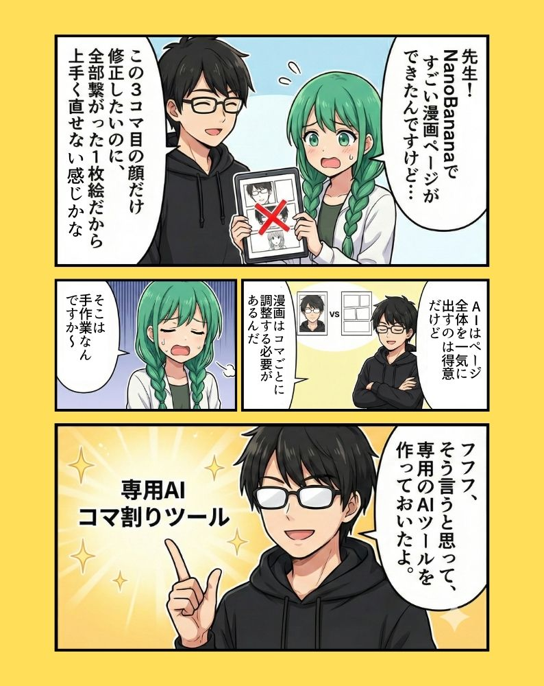
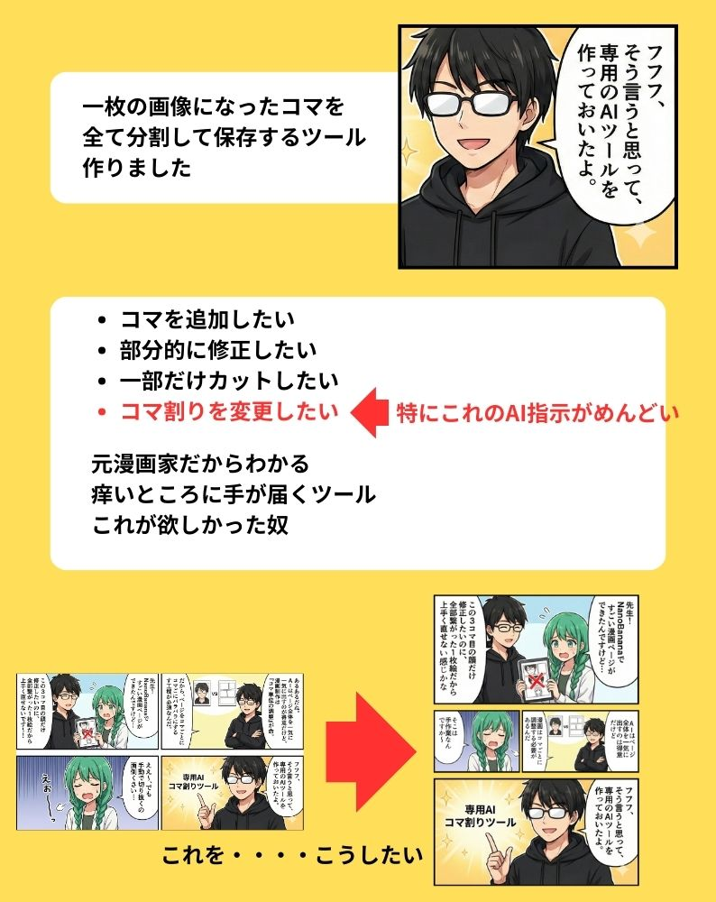
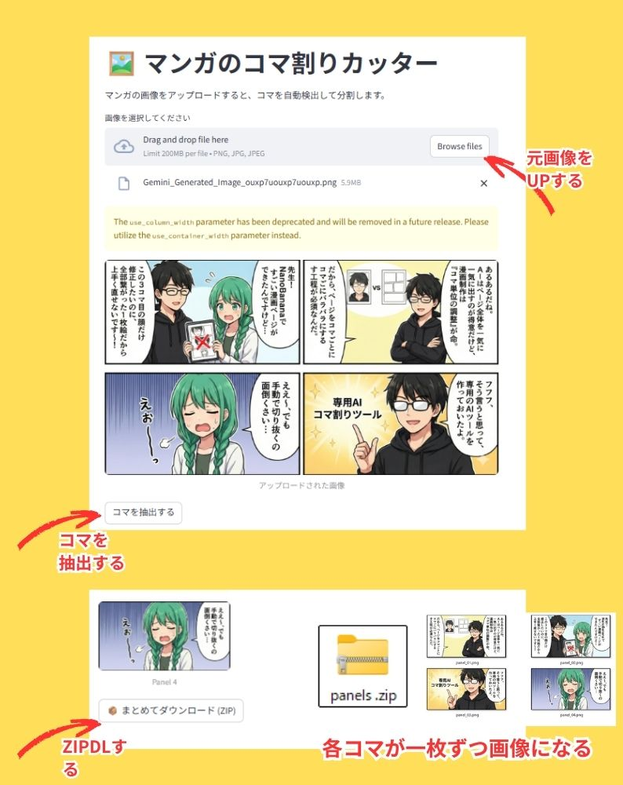

# 🖼️ Manga Panel Splitter (マンガコマ割りカッター)

**マンガの画像をアップロードするだけ！一瞬でコマごとに切り出して保存できるツールです。**

動画編集の素材作り、翻訳作業、データセット作成などの「コマ切り作業」を自動化します。

## 🚀 デモアプリ (Try it out!)
ブラウザですぐに使えます（インストール不要）：
**[👉 アプリを使ってみる (ここをクリック)](https://manga-panel-splitter-ehyfmzgpfhhbxc27jyciqi.streamlit.app/)**

---

## 💡 開発背景 (Story)
**「AIで作ったマンガ、修正するの面倒くさくないですか？」**
元漫画家の視点から、このツールが生まれた経緯をマンガにしました。

---

## 📖 使い方 (How to use)

画像ファイルをドラッグ＆ドロップするだけで完了します！

## 🚀 デモアプリ (Try it out!)
ブラウザですぐに使えます（インストール不要）：
**[👉 アプリを使ってみる (ここをクリック)](https://manga-panel-splitter-ehyfmzgpfhhbxc27jyciqi.streamlit.app/)**

1.  上記のデモアプリのリンクを開きます。
2.  マンガの画像（JPG/PNG）をドラッグ＆ドロップします。
3.  「コマを抽出する」ボタンを押します。
4.  結果を確認し、「まとめてダウンロード」ボタンで保存します。

## ✨ 特徴 (Features)

* **⚡ 自動検出**: 画像を解析し、コマの枠線を自動で認識してクロップします。
* **📦 一括DL**: 切り出したコマはZIPファイルでまとめてダウンロード可能。
* **🔒 プライバシー**: アップロードされた画像は保存されず、処理終了後にメモリから削除されます。

## 📖 使い方 (How to use)

1.  上記のデモアプリのリンクを開きます。
2.  マンガの画像（JPG/PNG）をドラッグ＆ドロップします。
3.  「コマを抽出する」ボタンを押します。
4.  結果を確認し、「まとめてダウンロード」ボタンで保存します。

## ⚠️ 注意点 (Limitations)

* **苦手な画像**: 「ぶち抜き（ページ全体を使ったコマ）」や「枠線が閉じていないコマ」、「変形コマ」は正しく認識されない場合があります。
* **推奨画像**: 白背景に黒い枠線がはっきり描かれている画像で最も高い精度を発揮します。

---

## 🛠️ 技術スタック (Tech Stack)
* [Streamlit](https://streamlit.io/) - Web App Framework
* [OpenCV](https://opencv.org/) - Image Processing
* Python

## 👨‍💻 Author
Created by [onitiku](https://github.com/onitiku)

---
*If you like this project, please give it a Star! ⭐*
